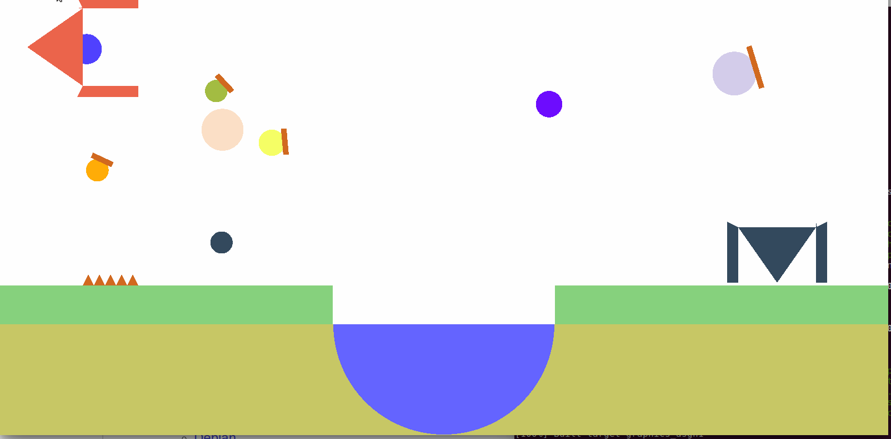

## Flying Ball

### Rules 
- Catch all the balls 
- Do not hit the spikes 
- Use the trampoline to jump higher 



### Run/Build (Linux)

	cd 20161170_assignment1
	chmod +x run.sh
	./run.sh 


### Controls 
	Arrow_key_up = UP
	Arrow_key_down = DOWN
	Arrow_key_left = LEFT
	Arrow_key_right = RIGHT

	Q = Quit 
	Scroll = Zoom 

	A = Camera left
	S = Camera down
	D = Camera right
	W = Camera up


### Objects Implemented 
	1. Trampoline = Higher Jump to the ball 
	2. Pool = Is viscous hence reduces the speed of the ball 
	3. Arc = Curve movement for higher jump using the arc in the pool 
	4. Magnet = Moves the ball to the right 
	5. Plank = Reflects the ball if collided with the plank 
	6. Continous world = The ball cannot go out of the screen 	
	7. Score is displayed with the title of the window.


```
			Thank you!!! Enjoy the game  
```			